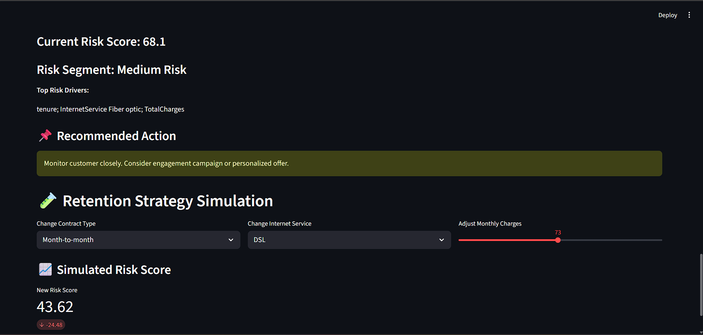

# 📊 Customer Churn Risk Intelligence System

**Live Demo:** *(Add your deployed link here once deployed)*  
👉 https://your-deployed-app.link

---

## 🧠 Project Overview

This repository contains a **production-style churn risk intelligence system** for telecom customers.

The system:

- Predicts customer churn risk (0–100)
- Provides interactive retention strategy simulation
- Supports dynamic threshold tuning
- Offers global and local feature explainability
- Helps business teams proactively retain users

---

## 🚀 Key Features

### 🔹 Model Evaluation
✔ ROC-AUC  
✔ Precision & Recall tuning  
✔ Confusion matrix  

### 🔹 Risk Dashboard
✔ Risk distribution  
✔ Risk filtering  
✔ Color-coded risk table

### 🔹 Explainability
✔ SHAP-style local explanations  
✔ Global feature importance ranking

### 🔹 Simulation Engine
✔ Change contract type  
✔ Change internet service  
✔ Adjust monthly charges  
✔ See how risk changes

---

## 🧱 Repo Structure
├── app/ # Streamlit dashboard
├── data/
│ ├── raw/ # Original dataset
│ └── processed/ # Model outputs + encoded data
├── models/ # Trained model files
├── src/ # Scripts
│ ├── train_model.py
│ ├── generate_risk_scores.py
│ └── evaluation_metrics.py
├── requirements.txt
└── README.md

## Getting Started

📌 1. Clone the Repo

```bash
git clone https://github.com/Navneet6050/customer-churn-risk-intelligence.git
cd customer-churn-risk-intelligence
```
📌 2. Install Dependencies
pip install -r requirements.txt

📌 3. Run the Dashboard
cd app
streamlit run app.py

🧠 Tech Stack

Python

Scikit-Learn

Streamlit

SHAP

Pandas / NumPy

📦 Dataset

Uses the Telco Customer Churn dataset.
Cleaned, preprocessed, modeled to produce features & risk scores.

💡 Business Impact

The system helps teams:

Prioritize retention

Understand risk drivers

Test retention strategies

📝 Author

Navneet — Data Scientist in progress
Connect : https://www.linkedin.com/in/contactnavneet04/

## 📊 Screenshots

### 🔹 Dashboard Overview


### 🔹 Risk Segment Distribution


### 🔹 Risk Score Histogram & Global Churn Drivers


### 🔹 Customers at Risk


### 🔹 Retention Strategy Simulation

